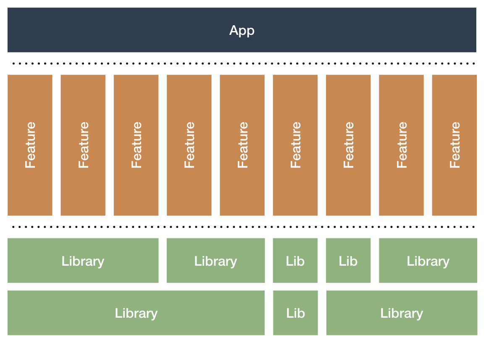

# Modular-App-MVVM-example

Modular app with MVVM 

This repository demonstrates a clearly defined, hierarchical layered architecure consisting of

- One App module
- Some feature library, represented in Feature modules, works like an independily anothers, has 
a specific fucntion insade of  all our project, SignIn Module, DataSource module: works like shared module to make api
requests, persistence of data and has the model layer.

MVVM pattern

Tecnologies used:
- MVVM pattern
- Modular app by feature
- Arquitecture components
- Dagger2
- Retrofit2

## links of interest

* [Jectpack guide](https://developer.android.com/jetpack/docs/guide ) 
* [Dagger2 & ViewModel](https://android.jlelse.eu/using-dagger2-intomap-api-for-android-viewmodel-injection-cffeb8dd0cdf) - Dependency Management
* [Google Examples](https://github.com/android/architecture-components-samples/tree/88747993139224a4bb6dbe985adf652d557de621 )
* [Dagger2 with kotlin](https://antonioleiva.com/dagger-android-kotlin/) 
## Contributing

## Authors

* **Carlos Blanco** - *Initial work* - [Carlos Blanco](https://www.linkedin.com/in/carlos-blanco-936552149/)

